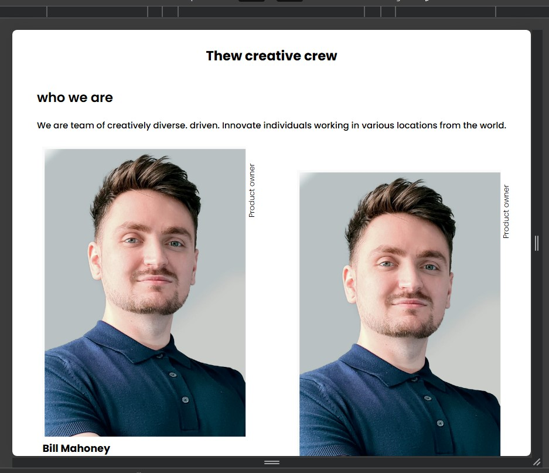

# Make It Real - My Team Page

This is a solution to the "my-team" projext of the Make It Real course.

## Table of contents

- [Overview](#overview)
  - [The challenge](#the-challenge)
  - [Screenshot](#screenshot)
- [My process](#my-process)
  - [Built with](#built-with)
  - [What I learned](#what-i-learned)
- [Author](#author)
- [Acknowledgments](#acknowledgments)

## Overview

### The challenge

Users should be able to:

- Write the HTML
- Write pure css
- Import google font

### Screenshot



## My process

### Built with

- Semantic HTML5 markup
- CSS custom properties
- Flexbox
- Mobile-first workflow

### What I learned

Flexbox:

```css
.container {
  display: flex;
  flex-wrap: wrap;
  justify-content: space-between;
}
```

## Author

- Twitter - [@yourusername](https://www.twitter.com/davichano)

## Acknowledgments

I find it stimulating to embark on a new course and acquire fresh knowledge after such a long hiatus.
